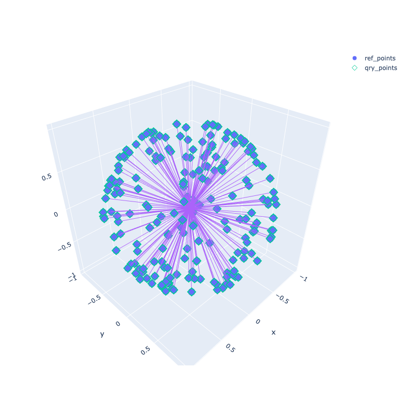

# [BOJ18614 - Cosmic Crossroads](https://www.acmicpc.net/problem/18614)
<!--tags: 3d, d&c, geom, math-->

간략화된 point cloud registration 문제로 이해하고 풀엇다. 
실제 데이터와는 다르게 데이터에 noise 도 없고 outlier 도 없다. 
또, translation 은 구할 필요가 없고 rotation 만 구하면 되기 때문에 실전에서 맞딱뜨리게 될 문제보다는 쉬운 편.

문제를 보자마자 풀이는 바로 떠올릴 수 있었지만, 
백준에 풀이를 제출할 때는 numpy 나 eigen 같은 라이브러리를 사용할 수 없기 때문에 구현을 하는데 조금 애를 먹었다. 
여기서는 본격적으로 문제를 풀기에 앞서 numpy로 간단히 풀어보았다. 

풀이는 3단계로 나뉘어진다. 

1. Feature extraction

Point마다 feature를 정의한다. 여기서는 가장 가까운 3 개 점까지의 cosine similarity를 feature vector로 사용하였다. 
이런식으로 feature를 정의하면 반드시 원점에 대칭되는 점은 같은 feature 를 공유하게 된다. 
KDTree 등의 자료구조를 사용하면 KNN query를 O(log(N))에 수행할 수 있다. 총 계산 시간은 O(Nlog(N)).

2. Putative match

계산된 feature를 바탕으로 두 point set 간의 매칭을 수행한다. 
대칭되는 point들이 feature를 공유하고 있기 때문에 여기서 계산한 match 는 50% 이하의 outlier 를 포함하게 될 것이다.
KDTree 등의 자료구조를 사용하면 매칭되는 점을 O(log(N))에 찾을 수 있다. 총 계산 시간은 O(Nlog(N)).

3. Ransac

Ransac 알고리즘으로 두 point set 간의 rotation을 계산하는 동시에 outlier를 날린다.
필요한 sample 갯수가 2개인 점과, inlier ratio가 50% 근처라는 점을 고려하면 불과 20-30회의 iteration으로 거의 확실히 최적 해를 찾을 수 있다는 계산이 나온다. 넉넉하게 100 번 계산을 해도 O(100N).


```python
import random
import numpy as np
from scipy.spatial.transform import Rotation as R

import plotly.graph_objects as go
from IPython.display import Image
```

# Generate some random test data


```python
def gen_points(n):
    points = np.random.normal(size=(3, n))
    points /= np.linalg.norm(points, axis=0)
    points = np.concatenate([points, -points], axis=1)
    return points[:, np.random.permutation(points.shape[1])]

def plot_points(ref_points, qry_points=None):
    fig = go.Figure()
    def add_trace(ps, name, symbol):
        fig.add_trace(go.Scatter3d(
            x=ps[0],
            y=ps[1],
            z=ps[2],
            mode='markers', name=name, marker_symbol=symbol))
        lines = np.concatenate([
            ps.T,
            np.zeros_like(ps).T,
            np.zeros_like(ps).T * np.nan], axis=1).reshape(-1, 3).T
        fig.add_trace(go.Scatter3d(
            x=lines[0],
            y=lines[1],
            z=lines[2],
            mode='lines', showlegend=False))
    add_trace(ref_points, 'ref_points', 'circle')
    if qry_points is not None:
        add_trace(qry_points, 'qry_points', 'diamond-open')
    fig.update_layout(
        scene = dict(
            aspectmode='data'
        ),
        width=800,
        height=800,
    )
    return(fig.to_image(format="png"))
```


```python
N = 100
gt_rot = R.random().as_matrix()
gt_perm = np.random.permutation(2 * N)

qry_points = gen_points(N)
ref_points = (gt_rot @ qry_points)
qry_points = qry_points[:, gt_perm]

# save it to use it as test data
with open('sample_random.in', 'w') as f:
    f.write(str(N) + '\n')
    for i in range(ref_points.shape[1]):
        f.write('{:.9f} {:.9f} {:.9f}\n'.format(*ref_points[:, i]))
    for i in range(qry_points.shape[1]):
        f.write('{:.9f} {:.9f} {:.9f}\n'.format(*qry_points[:, i]))
        
with open('sample_random.out', 'w') as f:
    rotvec = R.from_matrix(gt_rot).as_rotvec()
    angle = np.linalg.norm(rotvec)
    axis = rotvec / angle
    f.write('{:.9f}\n'.format(angle))
    f.write('{:.9f} {:.9f} {:.9f}\n'.format(*axis))
    f.write(' '.join(map(str, gt_perm + 1)) + '\n')

Image(plot_points(ref_points, qry_points))
```


    

    


# Feature extraction


```python
def extract_features(points):
    prod = points.T @ points
    prod.sort(axis=0)
    return prod[-4:-1, :]
    
ref_feats = extract_features(ref_points)
qry_feats = extract_features(qry_points)
```

# Putative match


```python
matches = []
for i in range(2 * N):
    diff = (ref_feats - qry_feats[:, i:i+1])
    ref_idx = np.linalg.norm(diff, axis=0).argmin()
    matches.append(ref_idx)

print('putative: ')
print([i + 1 for i in matches])
```

    putative: 
    [47, 148, 15, 15, 103, 180, 3, 95, 52, 68, 106, 102, 137, 112, 49, 30, 160, 94, 81, 101, 40, 168, 41, 80, 119, 62, 28, 110, 22, 102, 33, 21, 130, 123, 17, 110, 95, 26, 67, 71, 29, 12, 5, 173, 176, 59, 135, 76, 61, 86, 39, 43, 151, 180, 42, 8, 107, 121, 34, 137, 98, 119, 14, 160, 42, 6, 44, 90, 89, 19, 5, 33, 39, 74, 59, 91, 101, 40, 151, 186, 9, 185, 53, 93, 176, 109, 4, 62, 115, 25, 147, 46, 134, 90, 7, 57, 31, 38, 49, 70, 107, 2, 1, 70, 135, 79, 57, 48, 26, 186, 16, 51, 28, 12, 36, 134, 128, 185, 22, 4, 43, 68, 98, 47, 24, 20, 121, 18, 168, 80, 13, 76, 44, 41, 71, 23, 3, 20, 29, 48, 19, 128, 74, 147, 53, 6, 173, 52, 106, 58, 123, 32, 27, 130, 13, 46, 30, 21, 36, 67, 34, 86, 18, 96, 25, 1, 7, 89, 31, 63, 8, 17, 50, 103, 148, 38, 93, 112, 27, 91, 55, 58, 2, 79, 63, 9, 96, 94, 51, 23, 14, 109, 81, 115, 61, 50, 32, 24, 55, 16]


# RANSAC 


```python
def kabsch(qry_points, ref_points):
    # https://en.wikipedia.org/wiki/Kabsch_algorithm
    H = ref_points @ qry_points.T
    U, d, Vh = np.linalg.svd(H)
    S = np.eye(3)
    if np.linalg.det(U) * np.linalg.det(Vh) < 0:
        S[2, 2] = -1
    return U @ S @ Vh

# The RANSAC loop
inlier_threshold = 1e-6
best_rot = None
best_inliers = []
for _ in range(100):
    qry_idxs = random.sample(range(2 * N), 2)
    ref_idxs = [matches[i] for i in qry_idxs]
    qry = qry_points[:, qry_idxs]
    ref = ref_points[:, ref_idxs]
    rot = kabsch(qry, ref)
    
    inliers = []
    rotated = rot @ qry_points
    for i, j in enumerate(matches):
        distance = np.linalg.norm(rotated[:, i] - ref_points[:, j])
        if distance < inlier_threshold:
            inliers.append(i)
        
    if len(inliers) > len(best_inliers):
        best_inliers = inliers
        best_rot = rot
        
# fine fitting. 
inlier_qry_points = qry_points[:, best_inliers]
inlier_ref_points = ref_points[:, [matches[i] for i in best_inliers]]
best_rot = kabsch(inlier_qry_points, inlier_ref_points)

# recover permutation
perm = ((best_rot @ qry_points).T @ ref_points).argmax(axis=1)

# print ans
rotvec = R.from_matrix(best_rot).as_rotvec()
angle = np.linalg.norm(rotvec)
print("Answer: ")
print(angle)
print(' '.join(map(str, (rotvec / angle).tolist())))
print(' '.join(map(str, perm + 1)))

print("gt:")
with open("sample_random.out", 'r') as f:
    print(f.read())
    
mse = (ref_points[:, perm] - best_rot @ qry_points).__pow__(2).sum(axis=0).mean()
print("Mean square error:", mse)

Image(plot_points(ref_points, best_rot @ qry_points))


```

    Answer: 
    2.837848741090293
    -0.639317971395002 -0.7416208541703574 0.20315275068531274
    150 148 15 174 156 180 3 95 108 84 106 114 137 149 49 30 188 170 81 101 146 175 139 158 119 62 28 110 181 102 33 142 154 123 17 138 184 26 67 118 29 12 5 192 178 60 196 177 61 86 39 88 151 198 42 172 107 121 122 183 152 127 69 160 92 45 56 131 89 19 65 193 164 143 59 91 133 40 155 186 77 194 105 93 176 109 171 120 189 25 187 46 190 90 7 75 195 38 144 70 145 10 11 83 135 79 57 48 161 199 100 54 200 35 36 134 132 185 22 4 43 68 98 47 24 20 163 191 168 80 13 76 44 41 71 66 169 85 140 73 78 128 74 147 53 6 173 52 162 58 136 99 27 130 111 82 116 21 117 197 34 141 18 96 37 1 125 113 31 64 8 159 50 103 153 72 97 112 182 167 55 179 2 124 63 9 126 94 51 23 14 129 87 115 157 165 32 104 166 16
    gt:
    2.837848741
    -0.639317971 -0.741620854 0.203152751
    150 148 15 174 156 180 3 95 108 84 106 114 137 149 49 30 188 170 81 101 146 175 139 158 119 62 28 110 181 102 33 142 154 123 17 138 184 26 67 118 29 12 5 192 178 60 196 177 61 86 39 88 151 198 42 172 107 121 122 183 152 127 69 160 92 45 56 131 89 19 65 193 164 143 59 91 133 40 155 186 77 194 105 93 176 109 171 120 189 25 187 46 190 90 7 75 195 38 144 70 145 10 11 83 135 79 57 48 161 199 100 54 200 35 36 134 132 185 22 4 43 68 98 47 24 20 163 191 168 80 13 76 44 41 71 66 169 85 140 73 78 128 74 147 53 6 173 52 162 58 136 99 27 130 111 82 116 21 117 197 34 141 18 96 37 1 125 113 31 64 8 159 50 103 153 72 97 112 182 167 55 179 2 124 63 9 126 94 51 23 14 129 87 115 157 165 32 104 166 16
    
    Mean square error: 1.5296927287476517e-31


    

    


```python

```


```python

```
